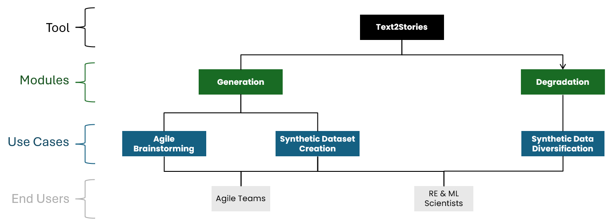
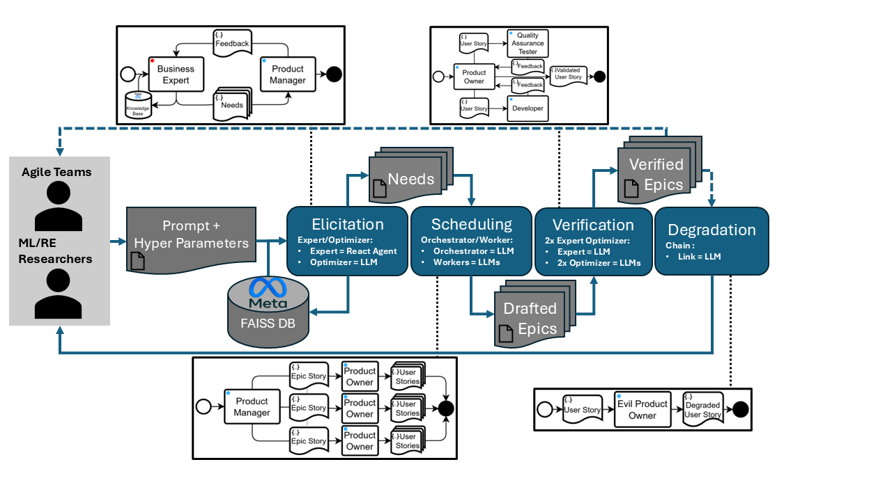

# Text2Stories

Public Complementary material & Model Implementation for Text2Stories

## Model's Purpose & Use Cases

Text2Stories has 2 modules, 3 identified use cases and 2 end-user.

## Model's Architecture

## Tools and Libraries

- **LLM Orchestration** : Langchain, LangSmith
- **Vector Database** : Meta FAISS
- **Agent Expert** : LangGraph

## Contributors

- Marius Ortega: m.ortega@groupeonepoint.com
- Hassan Imhah: h.imhah@groupeonepoint.com
- Vanande katchatrian: v.katchatrian@groupeonepoint.com
- Nédra Mellouli: nedra.mellouli@devinci.fr
- Christophe Rodrigues: christophe.rodrigues@devinci.fr
- Nicolas Travers: nicolas.travers@devinci.fr