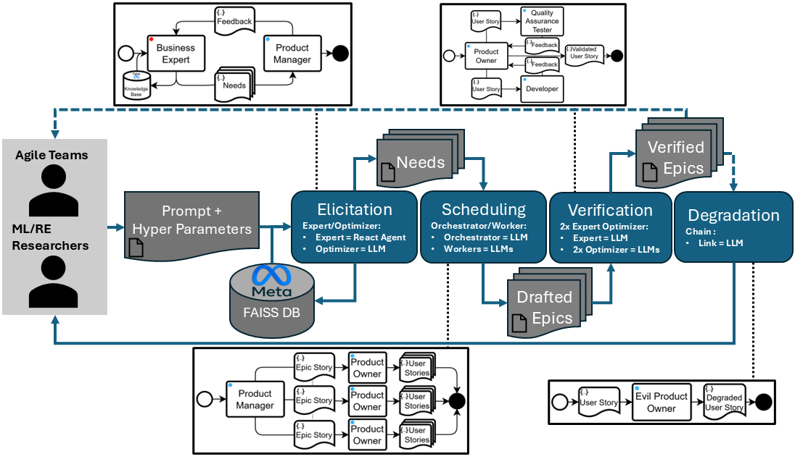

# Text2Stories

**Text2Stories** is a practical tool designed to assist both practitioners (Product Owners and other Agile team members), and researchers by automatically generating and evaluating user stories from natural language descriptions of software products.

---

## 🎯 Purpose & Use Cases

Text2Stories is built around **two main modules**, supports **three key use cases**, and is designed with **two end-user profiles** in mind.


---

## 🏗️ Architecture Overview

The model integrates a modular architecture leveraging advanced orchestration and agent collaboration frameworks.



---

## ⚙️ Installation

Follow these steps to install and run **Text2Stories** locally:

#### 1. Clone the Repository

```bash
git clone https://github.com/MariusAAROS/Text2Stories.git
cd Text2Stories
```

#### 2. Install Ollama
Follow the instructions on the [Ollama installation page](https://ollama.com/download) to set up Ollama on your system.

Ensure that Ollama is running and the model `llama3.2:1b` is downloaded. You can do this by running:

```bash
ollama serve
ollama pull llama3.2:1b
```
Then you can check if the model is available by running:

```bash
ollama list
```
The output should include a line such as : 
```bash
llama3.2:1b    baf6a787fdff    1.3 GB 
```
#### 3. Install Dependencies
:warning: This project uses Python 3.12.8 (Python 3.13 is not supported by Langgraph at this time).

Make sure you have Python 3.12 installed on your system. You can check your Python version by running:

```bash
python --version
```

If you don't have Python 3.12 installed, you can download it from the [official Python website](https://www.python.org/downloads/).

Once you have Python 3.12 installed, create a virtual environment and install the required dependencies:
```bash
python -m venv venv
venv\Scripts\activate  # On Linux use `source venv/bin/activate`
pip install -r requirements.txt
```

#### 4. Create your Configuration File
Create a `.env` file in the root directory of the repository. This file should contain the following environment variables:

- [Langsmith API key](https://www.langchain.com/langsmith)
- [Piste API key](https://piste.gouv.fr/)
- LLM Provider API key (Ours was [MistralAI](https://docs.mistral.ai/api/))

Example `.env` file:

```bash
LANGSMITH_TRACING=true
LANGSMITH_ENDPOINT="https://api.smith.langchain.com"
LANGSMITH_API_KEY="your_langsmith_api_key_here"
LANGSMITH_PROJECT="Text2Stories"

MISTRAL_API_KEY="your_mistral_api_key_here"

PISTE_ID = "your_piste_id_here"
PISTE_SECRET = "your_piste_secret_here"
PISTE_KEY="your_piste_key_here"
```

#### 5. Run the Application
The following command will start Langgraph Studio Text2Stories : 
```bash
langgraph dev
```

:trophy: Congratulations! You have successfully set up Text2Stories. You can now access the application at `http://localhost:2024`.

## 👥 Contributors

We gratefully acknowledge the contributions of the following individuals:

- **Marius Ortega** — [m.ortega@groupeonepoint.com](mailto:m.ortega@groupeonepoint.com)
- **Hassan Imhah** — [h.imhah@groupeonepoint.com](mailto:h.imhah@groupeonepoint.com)
- **Vanande Katchatrian** — [v.katchatrian@groupeonepoint.com](mailto:v.katchatrian@groupeonepoint.com)
- **Nédra Mellouli** — [nedra.mellouli@devinci.fr](mailto:nedra.mellouli@devinci.fr)
- **Christophe Rodrigues** — [christophe.rodrigues@devinci.fr](mailto:christophe.rodrigues@devinci.fr)
- **Nicolas Travers** — [nicolas.travers@devinci.fr](mailto:nicolas.travers@devinci.fr)

---

## 📂 Repository Structure

```bash
Text2Stories/
│
├── Ablation-Experiments/       # Ablation experiments displayed in the paper (LLM, LLM+CoT, RAG+CoT)
├── Data/                       # Use-Case-Specific Data for the RAG
├── Dataset/                    # Dataset used in the paper's experiments
├── demo/                       # Link to the demonstration video
├── images/                     # Diagrams and visual assets
├── Knowledge/                  # Knowledge Base for the RAG (vectorized data)
├── output/                     # Output files examples
├── Text2Stories/               # Core logic for story generation
└── README.md                   # You are here!
```